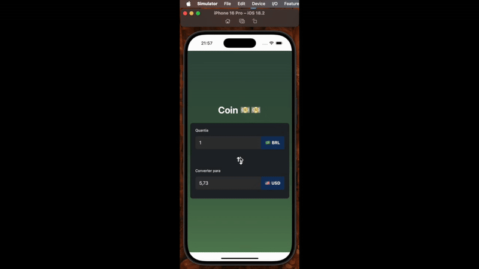

# Coin 💵

Este projeto é um conversor de moedas que consome dados de uma API pública para obter as cotações em tempo real. Desenvolvido com **React**, utiliza **Context API** para gerenciar o estado global e **Axios** para requisições HTTP.

## 📽️ Demonstração


## 🚀 Tecnologias Utilizadas
- **React** (useState, useEffect, Context API)
- **TypeScript**
- **Axios** (para requisições HTTP)
- **API Pública de Cotações**

## 📡 API de Cotações
As taxas de câmbio são obtidas de uma API pública de mercado financeiro. No momento, os dados são simulados a partir de um arquivo local, mas podem ser facilmente conectados a um serviço externo.

## 📦 Instalação e Uso
### Clonar o repositório
```bash
git clone git@github.com:Luizrtr/app-coin.git
cd app-coin
```

### Instalar dependências
```bash
yarn install
```

### Rodar o projeto
```bash
yarn expo start
```

## 📌 Funcionalidades
✅ Seleção de moeda base e moeda de conversão
✅ Atualização automática ao inserir valores
✅ Cálculo preciso com base nas taxas atuais
✅ Interface dinâmica e intuitiva

## 🛠 Melhorias Futuras
- Adicionar histórico de conversões
- Implementar suporte a mais moedas
